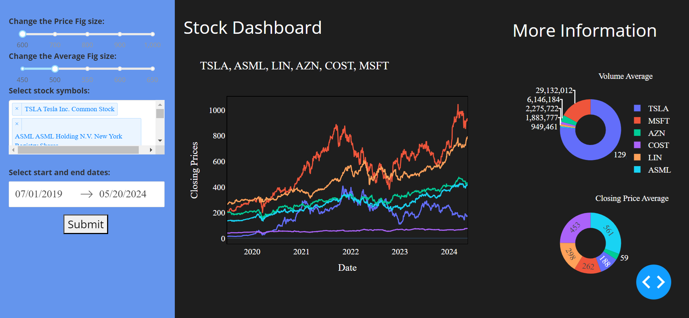

# Stock Market Dashboard

[Project Overview](#project-overview)  
[Features](#features)  
[Technologies Used](#technologies-used)    
[Usage](#usage)  
[Screenshots](#screenshots)   
[License](#license)   

---

## Project Overview

The goal of this project is to develop a dashboard that allows users to select one or more stocks, a start and end date, and have the closing stock prices displayed as a time series. Additionally, it shows the average of the volume and closing price for the selected time interval.

## Features

* **Interactive Dashboard:** Users can select stock symbols, date ranges, and view the closing prices of selected stocks.
* **Dynamic Graphs:** The dashboard dynamically updates based on user input, providing real-time insights into stock market performance.
* **Adjustable Fig Size:** Users can customize the size of the price and average figures using sliders.
* **Multiple Stock Selection:** Users can select multiple stock symbols to compare their performance.
* **Visual Representation:** Closing prices are represented in line graphs, while average volume and closing price data are represented in pie charts.

## Technologies Used

* **Dash:** Python framework for building analytical web applications.
* **Dash Bootstrap Components:** Provides Bootstrap-themed Dash components for building responsive layouts.
* **Pandas Datareader:** Retrieves data from various internet sources into pandas DataFrame.
* **Plotly:** Interactive graphing library for Python.
* **YFinance:** Python library to fetch historical market data from Yahoo Finance.
* **Plotly Template:** Set to 'plotly_dark' for a dark-themed visualization.
* **DateTime:** Python module for working with dates and times.

## Usage

* **Select Stock Symbols:** Choose the stock symbols you want to visualize by selecting them from the dropdown menu. You can select multiple symbols.
* **Specify Date Range:** Use the date picker to specify the start and end dates for the data you want to visualize.
* **Adjust Fig Size:** Use the sliders to adjust the size of the price and average figures according to your preference.
* **Submit:** Click the "Submit" button to update the dashboard with the selected options.
  
## Screenshots

*Description: This screenshot shows the overview of the dashboard with key metrics displayed.*

## License

This project is licensed under the MIT License.
